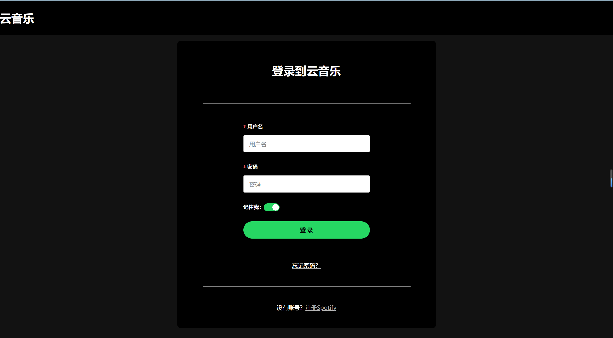
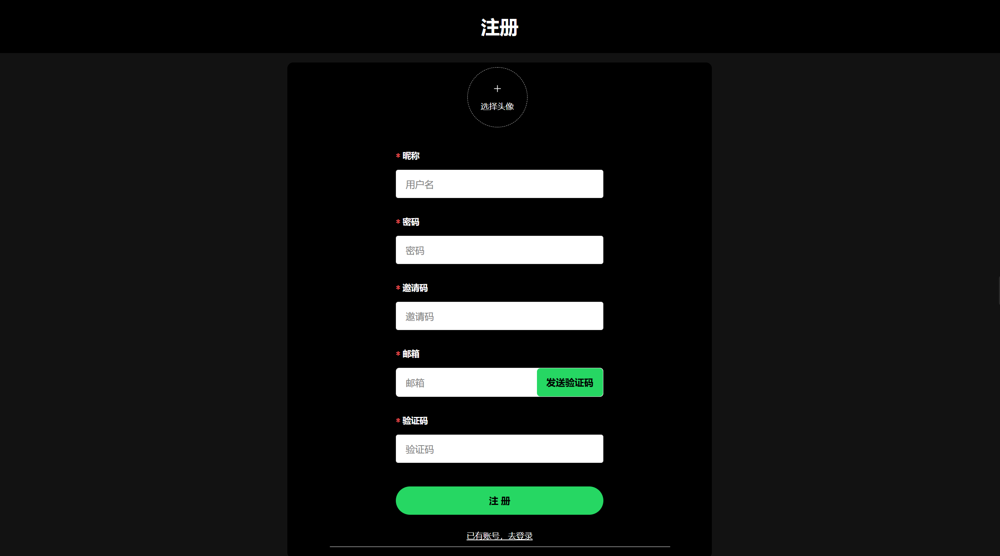
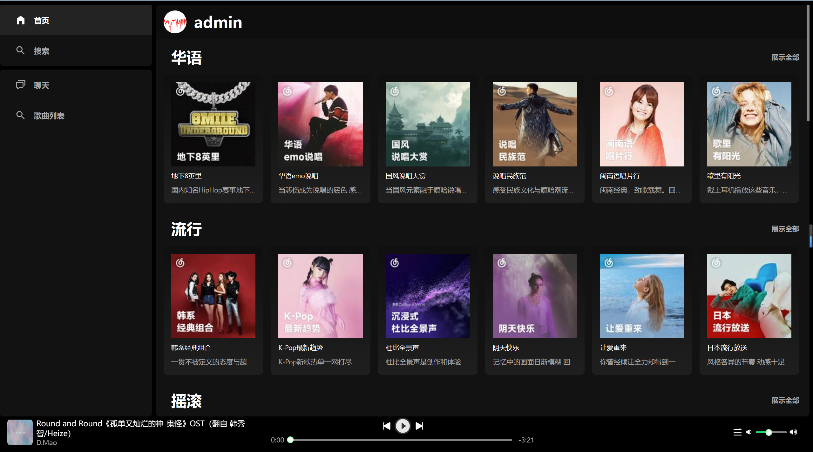
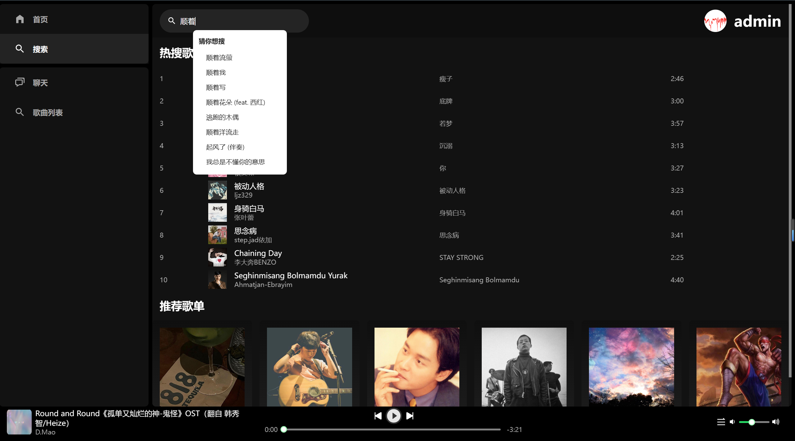
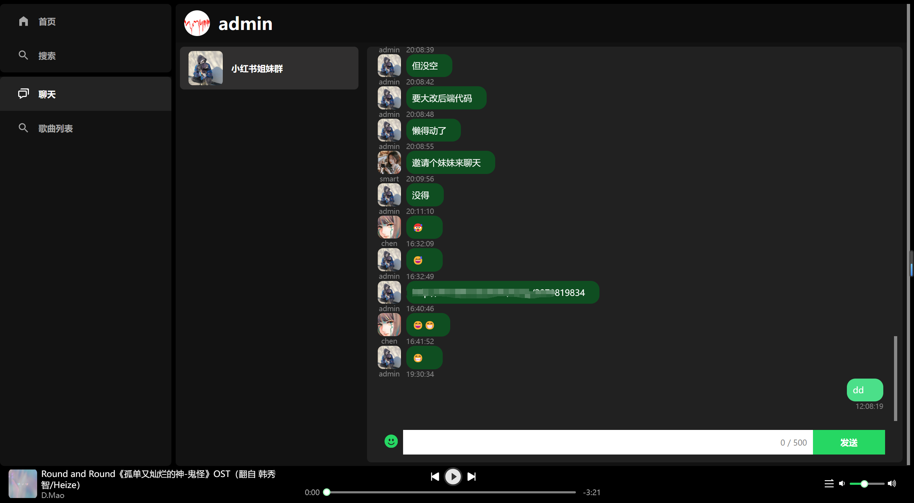
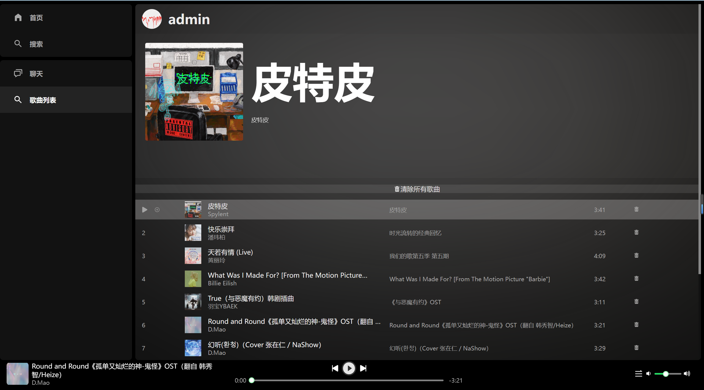
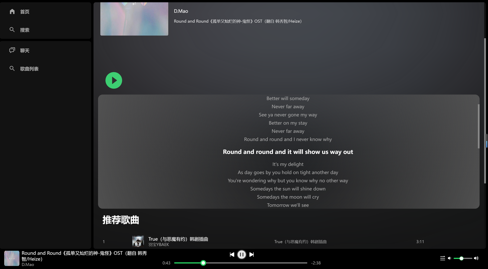
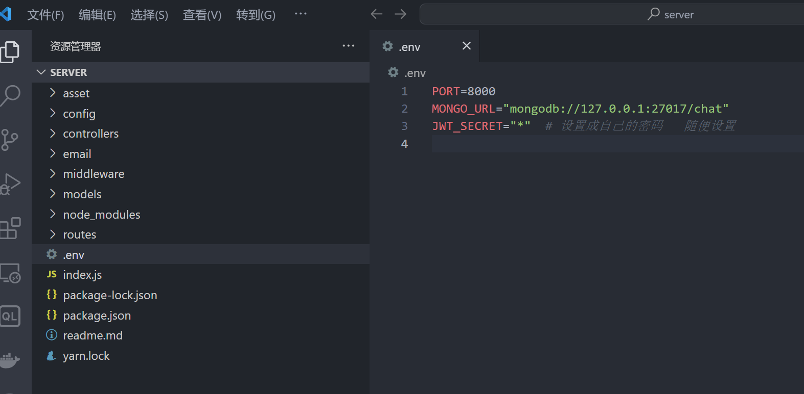

# 1.页面预览：

#### 登录界面



#### 注册页面：



#### 首页：



#### 搜索：



#### 聊天界面：



#### 歌曲列表：



#### 歌词高亮效果：




# 2.配置启动：

#### 前端安装：

```
cd react-ts-vite-music
npm install
npm run dev
```

#### 聊天+登录个人认证的后端：

```
cd server
npm install 
npm start
```



#### 音乐后端：

https://github.com/Binaryify/NeteaseCloudMusicApi